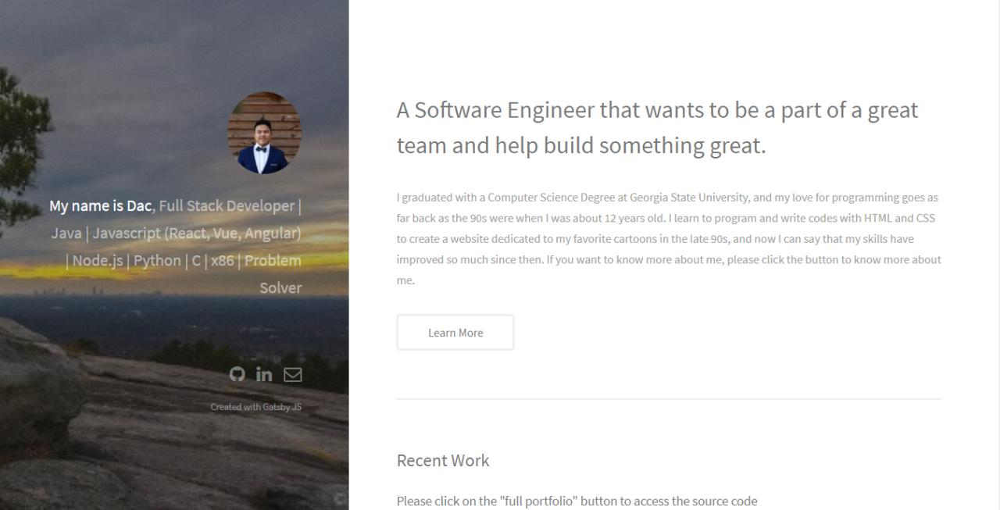

# My personal portfolio, built with Gatsby.js

**Technology used in this project**
1. Node JS.
2. HTML and CSS
3. Bootstrap CSS
4. React JS
5. Gatsby JS

## About

I was trying to create my portfolio website with React.js but the more I look into React, the more I heard about Gatsby.js. Gatsby is a free and open source framework based on React that helps developers build blazing fast websites and apps. I really enjoy the files structure and how easy it is to change everything as needed. Netlify is also very easy to use and I was able to deploy and host my Gatsby.js code with Github repository on my custom domain. To see my website, please click on the link below.

## Installation and running the application

If you haven't done so, please install [node.js](www.nodejs.org) to your current environment.

Then clone the current files and install this starter (assuming Gatsby is installed) by running from your CLI:
`npm install`

Run `gatsby develop` in the terminal to start.
